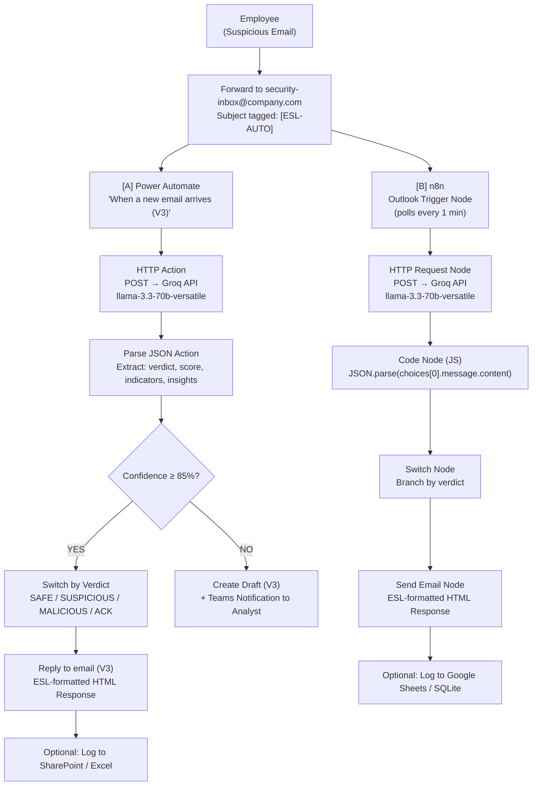

<div align="center">

# 🛡️ AI-Centric Email Security (ESL Automation)

**Zero-cost, AI-powered email threat response using Groq + Power Automate or n8n**

[](LICENSE)
[](https://groq.com)
[](https://flow.microsoft.com)
[](https://n8n.io)
[]()

</div>

---

## 📋 Overview

When an employee forwards a suspicious email to the security inbox with `[ESL-AUTO]` in the subject line, this system automatically:

1. **Triggers** on the incoming email (via Power Automate or n8n)
2. **Analyzes** the threat using Groq API (LLaMA 3.3-70B) — at **zero cost**
3. **Classifies** the email as `SAFE`, `SUSPICIOUS`, `MALICIOUS`, or `ACKNOWLEDGEMENT`
4. **Replies** with a formatted ESL Playbook response — instantly, 24/7

**Before this system:** Every suspicious email required a human analyst to manually review, write, and send a response — 10–30 minutes per email.

**After:** Zero-manual-effort ESL responses for ≥85% of flagged emails. Human in the loop for ambiguous cases.

---

## 🔀 Two Approaches, One Goal

This project implements **two parallel automation approaches** that produce identical outputs:

| Feature | [Approach A: Power Automate](approach-a-power-automate/) | [Approach B: n8n](approach-b-n8n/) |
|---------|--------------------------------------------------------|-----------------------------------|
| **Hosting** | Microsoft Cloud (included in M365) | Self-hosted (your PC or VPS) |
| **Cost** | Free (included in M365 license) | Free (open source) |
| **Setup Time** | ~2 hours | ~4 hours (includes OAuth setup) |
| **Always-On** | ✅ Yes (cloud-native) | ⚠️ Requires Task Scheduler or VPS |
| **Complexity** | Low — native connectors | Medium — needs OAuth + Node.js |
| **Status** | ✅ Complete | 🟢 Complete (OAuth blocker documented) |

> **Why two approaches?** Run both to compare reliability and latency. Power Automate is the fastest path to production. n8n gives you full control, no M365 dependency, and a migration path if licensing changes.

---

## 🏗️ Architecture



---

## 🚀 Quick Start

### Prerequisites

| Requirement | Details | Cost |
|-------------|---------|------|
| Microsoft 365 Work Account | For Power Automate + Outlook | Free (included) |
| Groq API Key | Sign up at [console.groq.com](https://console.groq.com) | Free (no credit card) |
| Node.js (n8n only) | LTS from [nodejs.org](https://nodejs.org) | Free |
| ESL Playbook Templates | Included in this repo → `approach-*/templates/` | Free |

### 1. Get Your Groq API Key

```bash
# No CLI needed. Just:
# 1. Go to https://console.groq.com
# 2. Sign up → API Keys → Create API Key
# 3. Copy and store securely — you'll need it for both approaches
```

### 2. Choose Your Approach

| I want to... | Start here |
|--------------|------------|
| Use Power Automate (fastest, cloud-native) | [`approach-a-power-automate/`](approach-a-power-automate/) |
| Use n8n (self-hosted, full control) | [`approach-b-n8n/`](approach-b-n8n/) |

### 3. Configure & Deploy

Each approach directory contains:
- A complete step-by-step **guide**
- **Importable workflow** definitions
- **HTML email templates** for all 4 verdicts
- Configuration references

---

## 📂 Repository Structure

```
.
├── README.md                          # ← You are here
├── LICENSE                            # MIT License
├── documentation.md                   # Historical reference (kept for continuity)
│
├── shared/                            # Shared across both approaches
│   ├── system-prompt.txt              # Groq ESL system prompt
│   ├── ai-response-schema.json        # JSON schema for AI output
│   └── trigger-specification.md       # ESL trigger contract
│
├── approach-a-power-automate/         # Microsoft Power Automate implementation
│   ├── README.md                      # Full guide & walkthrough
│   ├── flow-definition.json           # Documented flow structure
│   └── templates/
│       ├── acknowledgement.html
│       ├── safe.html
│       └── suspicious-malicious.html
│
├── approach-b-n8n/                   # n8n self-hosted implementation
│   ├── README.md                      # Full guide & walkthrough
│   ├── workflow.json                  # Importable n8n workflow
│   ├── templates/
│   │   ├── acknowledgement.html
│   │   ├── safe.html
│   │   ├── suspicious.html
│   │   └── malicious.html
│   └── scripts/
│       └── setup-n8n.ps1             # Windows setup automation
│
├── docs/                              # Supplementary documentation
│   ├── architecture.md                # Deep-dive system architecture
│   ├── comparison.md                  # Power Automate vs n8n comparison
│   ├── troubleshooting.md             # Common issues & solutions
│   └── oauth-setup.md                 # n8n Microsoft OAuth guide
│
└── scripts/                           # Cross-cutting utilities
    ├── setup-n8n.sh                   # n8n setup for Linux/macOS
    └── validate-templates.sh          # Template validation helper
```

---

## 🤖 AI Backend: Groq API

| Detail | Value |
|--------|-------|
| **Provider** | [Groq](https://groq.com) — free tier |
| **Model** | `llama-3.3-70b-versatile` |
| **Rate Limits** | 30 req/min, 14,400 req/day |
| **Cost** | $0 (free tier — no credit card required) |
| **Response Format** | Structured JSON (`response_format: json_object`) |
| **Fallback** | Manual review if API is unavailable |

The system prompt (see [`shared/system-prompt.txt`](shared/system-prompt.txt)) is calibrated against the ESL Playbook's 4-phase analysis framework: heuristic indicators, hyperlink/URL red flags, OSINT/domain reputation, and SPF/DKIM/DMARC header authentication.

---

## 📊 AI Response Schema

The Groq API returns a structured JSON object consumed by both approaches:

| Field | Type | Values |
|-------|------|--------|
| `verdict` | string | `SAFE`, `SUSPICIOUS`, `MALICIOUS`, `ACKNOWLEDGEMENT` |
| `threat_classification` | string | `Phishing`, `Spam`, `Malware`, `BEC`, `Legitimate` |
| `indicators` | string[] | Array of detected red flags |
| `recommendation` | string | Action text for the employee |
| `operator_insights` | string | Professional paragraph for email body |
| `confidence_score` | int | 0–100 (auto-send threshold: ≥85) |

Full schema: [`shared/ai-response-schema.json`](shared/ai-response-schema.json)

---

## 🔒 Security & Compliance

| Principle | Implementation |
|-----------|---------------|
| **No hardcoded secrets** | API keys stored in Platform Environment Variables / Credentials Store |
| **Human in the loop** | Confidence < 85% → draft mode + analyst notification |
| **Privacy by design** | Metadata-only audit logging — no email body storage |
| **Tag-based activation** | Only `[ESL-AUTO]` tagged emails trigger automation |
| **No auto-block** | MALICIOUS verdicts flag for review — no automatic domain blocking |

---

## 🧪 Testing

```bash
# Send a test email to trigger the automation
# To: security-inbox@your-company.com
# Subject: [ESL-AUTO] Test phishing email

Expected result:
1. ✅ Flow triggers on arrival
2. ✅ Groq API returns structured analysis
3. ✅ Correct template selected by verdict
4. ✅ Reply sent (confidence ≥85%) or draft created (<85%)
```

---

## 📈 Optional Enhancements

| Enhancement | Description | Status |
|-------------|-------------|--------|
| Audit Logging | Log all assessments to SharePoint/Excel or Google Sheets | 🔲 Optional |
| Reference Numbers | Auto-generate `ESL-2026-XXXX` case IDs | 🔲 Optional |
| Domain Block | Auto-block MALICIOUS sender domains via Microsoft Graph API | 🔲 Optional |
| Escalation Flow | Secondary flow for repeat senders / BEC patterns | 🔲 Optional |
| Power BI Dashboard | Threat volume, verdict distribution, response time trends | 🔲 Optional |

---

## 🤝 Contributing

This is an open-source guide project. Contributions welcome!

- **Found a bug** in a template? Open an issue or PR.
- **Added a feature** (like audit logging)? Submit a PR with the enhancement documented for both approaches.
- **Question?** Open a discussion.

> Both approaches must maintain parity. If you change logic in one, update the other.

---

## 📄 License

MIT — see [LICENSE](LICENSE).

---

<div align="center">
  <strong>Built with ❤️ for cybersecurity teams everywhere</strong>
  <br/>
  <sub>No AI model was paid for in the making of this automation.</sub>
</div>
